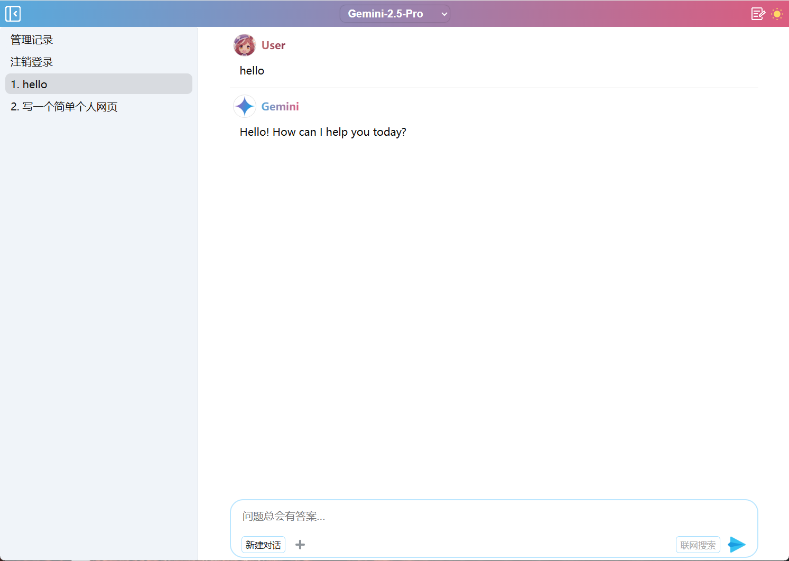

# Gemini
### 用Google免费的Gemini API搭建一个自己的AI对话网页，可以实现免翻墙使用Google AI
#### API获取地址：https://aistudio.google.com/app/apikey
### 可以在海外服务器搭建，也可以在本地电脑搭建(不能访问谷歌地区请看.env文件说明)
### 网页UI示例


- 基本功能：文字对话，上传文件(对话上下文为当前对话全部)，新建对话，保留历史多轮对话。
- 网页代码很少，响应很快，布局适配桌面+移动设备，支持夜间配色。

## 使用方法  
#### 支持主流平台Windows，Linux，MacOS，及其他能安装node.js的平台
### 1，安装node.js，方法很简单，自己搜索
### 2，下载本仓库
- 在backend目录找到`.env--示例文件`， **重要** ：修改文件名为`.env`，打开输入你的API和其他自定义信息
### 3，安装及运行
- 在backend目录下运行命令
- 初始化项目
```
npm init -y

npm install
```
- 启动程序服务
```
node server.js
```
- 如果没报错的话
- 浏览器可以打开http + 你的IP + 端口，就能访问了
### 4，其他事项
- #### 在公网服务器强烈建议反代加上https并设置复杂密码
- #### 不能访问谷歌的地区记得设置代理
- 可以自建代理，用自己域名透明代理官方地址`https://generativelanguage.googleapis.com`即可
- 个人测试地址`https://cdn-gm-api.855655.xyz`不长期维护，浏览器打开能显示文字就说明还可以用